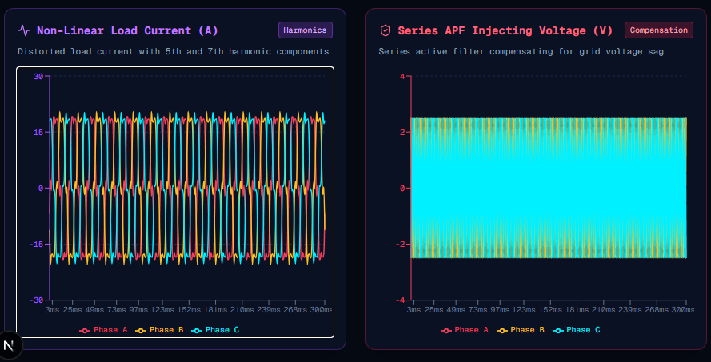
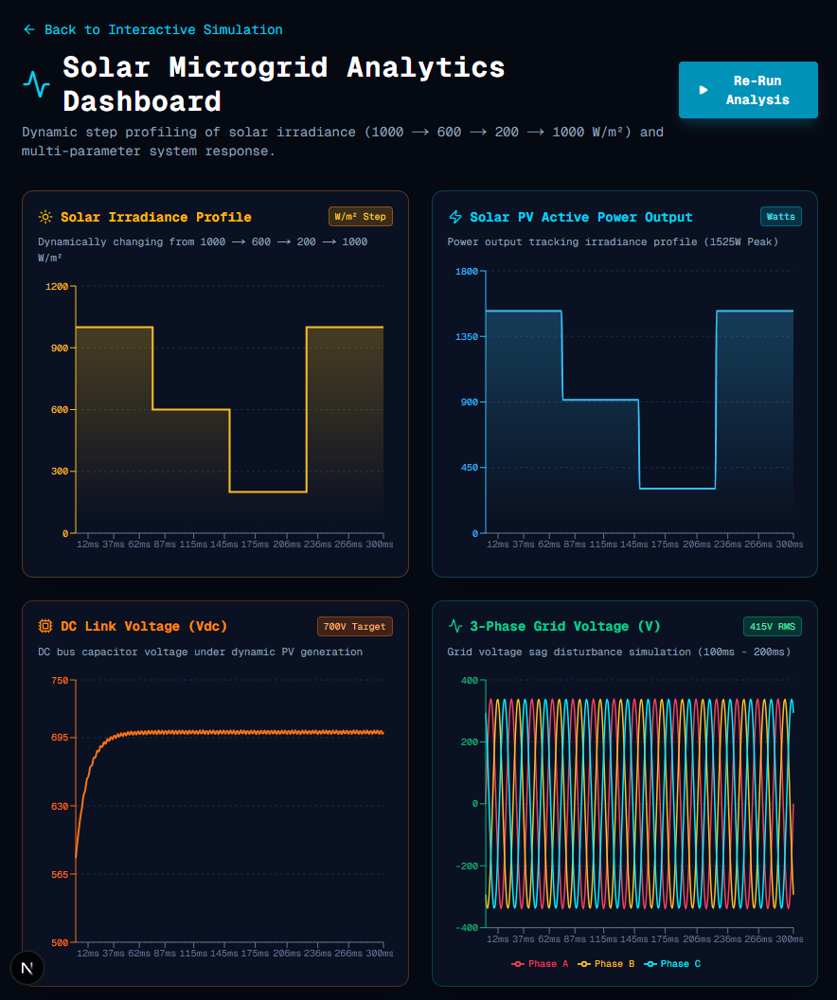
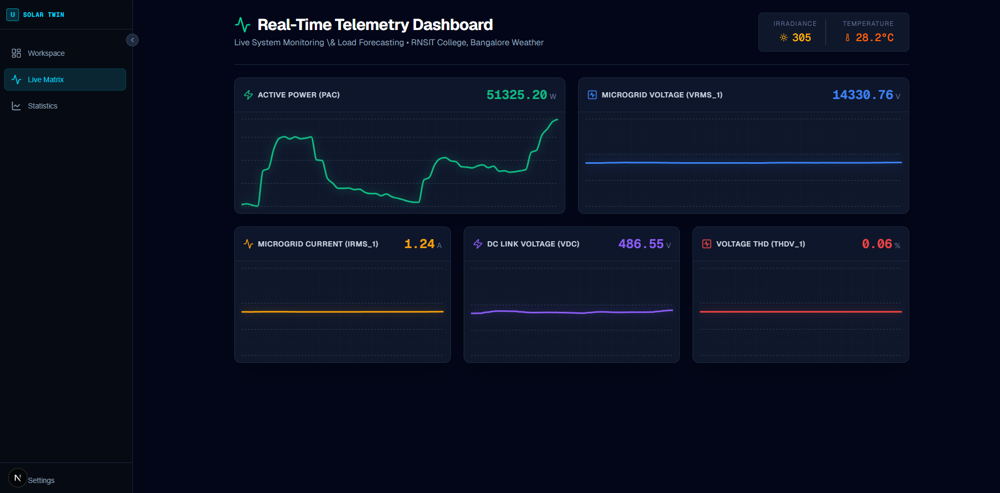
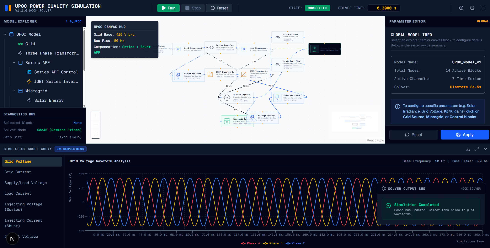

# PROJECT STATUS REPORT
**SOLARTWIN:** A Digital Twin Framework for Power Quality Management in Solar Energy Systems
*Submitted to Principal through Head of Department (HOD)*

---

## 1. Executive Summary
This initiative aims to engineer a comprehensive Digital Twin framework dedicated to power quality management, real-time monitoring, and predictive fault classification within standalone solar PV microgrids. The project commenced with an extensive domain analysis of PV array degradation dynamics (utilizing 88 x 7 SunPower SPR-415E-WHT-D panels, totaling 255.6 kW capacity), energy storage systems, and power quality challenges associated with modern converters. Following this, a physics-based, high-fidelity simulation engine for the PV array and an interactive operator web platform were successfully architected (Figure 3).

Key simulation milestones achieved include the precise modeling of dynamic solar irradiance profiles (DeepDip, RampDown, RampUp, ShallowCloud, and DoubleDip, as detailed in Figure 1), panel thermal shifts (15°C to 50°C), non-linear load harmonics (5th and 7th orders), and robust DC-link voltage stabilization at 700V DC. Utilizing this validated baseline model, **25 distinct operational scenarios**—systematically modulating irradiance, operating temperatures, system voltage sags, harmonic distortions, and battery State of Charge (SOC)—were executed to generate a comprehensive time-series dataset. The project has successfully entered the initial prototyping phase of the **LSTM neural network** for predictive forecasting. Concurrently, a **live weather API targeting the RNSIT campus location** has been integrated to ingest real-time local meteorological data. While the foundational LSTM architecture is operational, further optimization and hyperparameter tuning are imperative to elevate its generalization capabilities and predictive accuracy before moving to production.

| Project Name | SolarTwin: A Digital Twin Framework for Power Quality Management |
|---|---|
| **Institution / Dept.** | RNS Institute of Technology (RNSIT) \| Dept. of Computer Science & Engineering |
| **Reporting Scope** | Solar PV Array Simulation, Operator Web Platform & Milestone Progress |
| **Overall Status** | **On Track** (Circuit Simulation & Web Platform Live \| ML & Control Modules In Progress) |

## 2. Key Metrics

| Progress | Milestones Achieved | Pending Items | Next Milestones |
|---|---|---|---|
| **On Track** | - Conducted exhaustive domain research on PV array circuit parameters and aging degradation. - Engineered a physics-based circuit simulation for the solar PV array (255.6 kW capacity), battery, and inverter. - Implemented complex solar irradiance step profiling alongside thermal shift modeling. - Modeled active power compensation and robust DC-link voltage regulation (700V DC). - Developed and deployed an interactive operator web platform featuring a 6-card Analytics Dashboard. - **Executed 25 rigorous simulation scenarios** to export validated time-series datasets. | - Finalize MQTT real-time data streaming pipeline. - Optimize the initial LSTM forecasting prototype to enhance predictive accuracy and mitigate overfitting. - Stabilize the live weather API data ingestion pipeline (targeting the RNSIT location) for live forecasting. - Optimize fault classification engine targeting >90% accuracy. - Architect ANFIS rule-based control layer for automated remediation. - Integrate live operator alerts and manual override controls within the UI. - Execute comprehensive Hardware-in-the-Loop (HIL) testing and system benchmarking. | - **M1:** Real-Time Data Pipeline (MQTT) - **M2:** LSTM Prediction & Fault Classifier - **M3:** ANFIS Rule-Based Control Engine - **M4:** HIL Verification & Final Rollout |

## 3. Scope & Technology Stack

| | |
|---|---|
| **Project Objective** | Architect a digital twin ecosystem for a standalone solar PV array microgrid (encompassing a Simulation Model, Predictive Neural Model, and Rule-based Control Layer) to forecast voltage drops 30 seconds in advance, classify fault signatures with >90% accuracy, and deploy automated power quality remediation. |
| **Technology Stack** | **Simulation Engine:** MATLAB, Simulink, Simscape Electrical, TypeScript Discrete Solver **Web Platform & UI:** Next.js, React, TypeScript, TailwindCSS, Recharts, React Flow **AI/ML Pipeline:** Python, PyTorch / TensorFlow (LSTM Networks), XGBoost, Pandas, NumPy **Data Protocols:** ANFIS, MQTT, REST, JSON time-series frameworks |
| **Student Details** | **Name:** Raj Aryan **USN:** 1rx24cs193 **Department:** Computer Science & Engineering, RNS Institute of Technology (RNSIT) |
| **Project Guide** | **Department:** Dept. of Computer Science & Engineering, RNSIT |

## 4. Work Completed (Highlights)
- **Initial Domain Research & Audit:** Investigated standalone solar microgrid dynamics, lifecycle degradation curves for SunPower 415W PV modules (510.3V DC string operating voltage, 500.7A DC operating current), charging characteristics of battery storage, and the sources of harmonic distortions in PV networks.
- **Physics-Based PV Array Circuit Simulation:** Developed a mathematical formulation simulating the 88 x 7 SunPower 415W PV array (255.6 kW total capacity), non-linear diode rectifier loads, active power compensation control loops, and tight 700V DC-link voltage regulation.
- **Dynamic Solar Irradiance & Temperature Profiling:** Successfully modeled abrupt solar radiation step variations (DeepDip, RampDown, RampUp, ShallowCloud, DoubleDip) concurrently with operating temperature shifts (15°C to 50°C) to rigorously evaluate active power tracking and ride-through capabilities over transient windows.
- **Harmonic Distortion & Voltage Compensation:** Simulated 5th and 7th order harmonic currents injected by diode rectifier loads, demonstrating active series voltage injection effectively neutralizing system voltage sags.
- **Operator Analytics Web Platform:** Engineered a comprehensive web application featuring an interactive digital twin canvas and a 6-card analytics dashboard rendering live waveforms for Irradiance, PV Power, DC Link Voltage, 3-Phase Array Voltage, Load Current, and Injecting Voltage.
- **25-Scenario Data Collection:** Executed 25 discrete operational scenarios systematically varying solar irradiance step profiles and operating temperatures, extracting precise time-series datasets.
- **LSTM Initial Prototype & Live Weather API:** Successfully developed the foundational phase of the LSTM neural network model for predictive forecasting. Integrated a live weather API targeting the RNSIT location for real-time meteorological telemetry (irradiance, temperature), establishing the groundwork for live AI-driven analytics.

## 5. Deliverables & Submitted Outputs
- Validated solar PV array circuit simulation engine alongside numerical solvers.
- Full-stack interactive operator monitoring website housing the 6-card analytics dashboard.
- **25-Scenario Time-Series Dataset** detailing irradiance fluctuations and temperature impacts, optimized for neural network ingestion.
- Architectural blueprint for the LSTM neural network forecasting and fault classification models.
- Comprehensive project presentation slides outlining baseline simulation results and strategic roadmap.

## 6. Individual Contributions
- **Raj Aryan (USN: 1rx24cs193):**
  - Conducted fundamental baseline research concerning solar PV array degradation and overall microgrid power quality metrics.
  - Formulated the PV array circuit simulation equations, integrated the dynamic irradiance and thermal step solvers, and tuned the active power control loops.
  - Designed, programmed, and deployed the Next.js and React-based web platform alongside the live Recharts analytics dashboard.
  - **Executed the exhaustive 25-scenario simulation sweep**, successfully harvested time-series data, and initiated the primary LSTM neural network training pipeline.

## 7. Risks, Issues, and Dependencies

| Identified Risk / Issue | Potential Impact | Current Status |
|---|---|---|
| Synthetic simulation data overfitting during LSTM neural network training | Potential forecasting inaccuracies when transitioning to real-world, noisy sensor feeds | Model Validation In Progress |
| High-frequency inverter switching ripple present in time-series data | Requires strategic noise filtering pipelines prior to feeding the LSTM models | Data Filtering In Progress |

## 8. Next Planned Activities

| Planned Activity | Expected Output | Target Deliverable |
|---|---|---|
| Establish MQTT Real-Time Data Pipeline | Live, synchronized time-series data streaming telemetry loop | Real-Time Data Pipeline |
| Optimize Initial LSTM Forecasting Prototype | Intelligent model capable of predicting voltage/power sags 30s in advance | Tuned LSTM Model |
| Develop Fault Classification Engine | Algorithm to classify voltage drops, spikes, and outages with >90% accuracy | High-Accuracy Classifier |
| Implement ANFIS Rule-Based Control Layer | Robust rule-based decision layer to validate corrective mitigation strategies | ANFIS Control Engine |
| Operator Alert & Manual Override System | Live visual gauges, early warning alerts, and manual override UI controls | Interactive Dashboard |
| Hardware-in-the-Loop (HIL) Benchmarking | Comprehensive HIL verification and final system performance documentation | Benchmarking Report |

## 9. Project Visualizations & Analytics

**Figure 1: Power Quality Analytics and PV Array Performance Telemetry Plots**

*(a) Solar Irradiance Step Profile & Active Power Output*

*(b) Non-Linear Load Harmonics & Series Injecting Voltage*

**Figure 2: Live Telemetry Dashboard with Real-Time Weather API Integration (RNSIT Location)**

**Figure 3: SolarTwin Web Platform User Interface and Underlying Architecture**

*(a) Interactive Solar Microgrid Web Platform Canvas*

*(b) Digital Twin System Architecture & Data Pipeline*

## 10. Attendance & Resource Participation

| Total | Present | Absent | % | Remarks |
|---|---|---|---|---|
| 1 | 1 | 0 | 100% | Raj Aryan (USN: 1rx24cs193) - Full operational participation. |

## 11. Review & Approvals

| Prepared By | Reviewed By | Approved By |
|---|---|---|
| Name: **Raj Aryan (USN: 1rx24cs193)** Date: \_\_ / \_\_ / 2026 | Name: **\_\_\_\_\_\_\_\_\_\_\_\_\_\_\_\_\_\_\_** Date: \_\_ / \_\_ / 2026 | Name: **\_\_\_\_\_\_\_\_\_\_\_\_\_\_\_\_\_\_\_** Date: \_\_ / \_\_ / 2026 |
